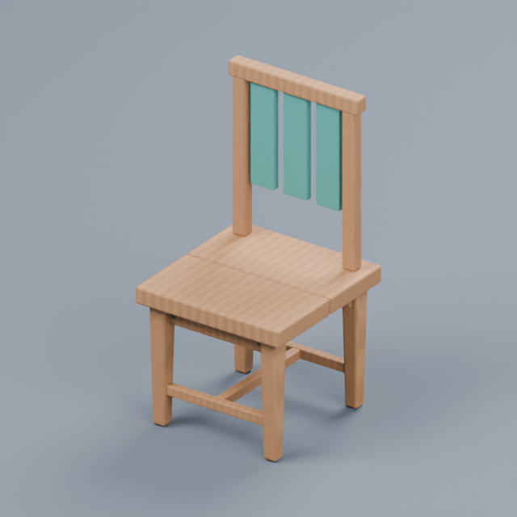

# Prompt-to-Scene

**Build styled props in Blender with your AI, compare real 3D drafts, refine parts, and send the result straight to Unity or Unreal.**

[简体中文](README.zh-CN.md) · [Download](https://github.com/316sandon12/prompt-to-scene/releases/latest) · [Beginner setup](docs/QUICKSTART.zh-CN.md) · [v0.6 workbench guide](docs/WORKBENCH.zh-CN.md) · [Verified results](docs/verification.md)

Connect **Codex / DeepSeek Harness → Blender → Unity / Unreal Editor**. Your existing AI client interprets the request; Blender runs locally. The bridge prepares materials, imports native assets, places instances and verifies the result. Python is bundled in the download. No additional modeling subscription is required.

> v0.6 is experimental and targets static opaque props. Install Blender, an engine editor and a working AI client first. The local workshop also prepares existing models and operates the library without an LLM.



*An actual studio render of the built-in chair, with editable semantic parts and baked PBR surfaces. Engine lighting and rendering can produce different results.*

## Install

[**Windows x64**](https://github.com/316sandon12/prompt-to-scene/releases/latest/download/Prompt-to-Scene-windows-x64.zip) · [**macOS Apple Silicon**](https://github.com/316sandon12/prompt-to-scene/releases/latest/download/Prompt-to-Scene-macos-arm64.zip)

1. Extract the download and open **Prompt-to-Scene**. Keep both Windows EXE files together.
2. Select an engine project and click **Connect / 连接并准备项目**. The app locates Blender and installs the bridge.
3. Click **Install Codex plugin** or **Install Harness plugin**, restart that client and start a new chat.

Keep the editor open outside Play mode. Restart UE once after installing the bridge. Say:

> “Use Prompt-to-Scene. Set a cozy art style for this project and show me three chair designs before publishing one.”

Or choose a prop in **创作工作台 / Workshop**, compare candidates and publish your favorite. Ordinary requests can build directly without a mandatory selection step. **Generate example crate / 生成示例木箱** tests the complete pipeline without AI.

Community binaries are unsigned on Windows and ad-hoc signed, not notarized, on macOS. First-launch guidance and client setup: [beginner guide](docs/QUICKSTART.zh-CN.md). Source users can run `uv sync --locked` and `uv run prompt-to-scene-app`. Other MCP clients can use [manual setup](docs/manual-setup.md).

## v0.6: one workbench, six workflow improvements

| Feature | Implemented behavior |
| --- | --- |
| Unified workbench | Local UI plus optional MCP App; shared task cards, editor object selection, real previews, cancellation and workflow resume. Normal tools also work without an embedded UI. |
| Furnished scene kits | Build and arrange three matching kits, arbitrary upright yaw, surface alignment, face-anchor placement, saved layout reuse and undo. |
| Art review loop | Persistent reference images/notes, native diagnostics, same-camera evidence and at most two concrete repairs with automatic recapture. No fabricated aesthetic score. |
| External part editing | Group source meshes, edit or replace one part, independent locks, preserved untouched geometry, validated bake reuse and native material-only updates. |
| Usage-aware preparation | Native geometry/material/texture/LOD measurements; mobile, scene and hero presets. Texture memory is labeled as an estimate; no inferred FPS. |
| Optional model generation | Meshy text/image adapters or a documented self-hosted API, 1–3 candidates, saved remote IDs, preview → preparation → native import. Paid provider use is explicit. |

Say **“Make and furnish a reading corner rotated 35 degrees”**, **“Only change this imported model's rim”**, or **“Compare this prop to our saved art reference and fix the specific differences.”** [Full v0.6 guide](docs/WORKBENCH.zh-CN.md) · [Provider contract and test boundaries](docs/PROVIDERS.md).

## v0.5: existing models into game assets

| Improvement | What is implemented |
| --- | --- |
| Asset intake | Local GLB/glTF, FBX and Blender files, plus credited Poly Haven CC0 search/download. Models produced by another AI tool enter the same workflow. |
| Game preparation | Retained original; size/axis correction; measured simplification; opaque PBR and source-normal baking; native Unity LODGroup / UE LODs; box/convex/no collision. Failed geometry budgets never enter the import queue. |
| Better visual iteration | Three curated matching kits, three structural variants for each of nine recipes, consistent source studio framing, native before/after captures with a saved camera, and selection-driven recipe edits. |

Try: **“Prepare this GLB for 8,000 triangles, make its largest dimension 1.5 meters, generate LODs and send it to Unity.”** Or **“Find a Poly Haven ceramic vase and show its prepared preview before importing.”** File intake never bills generation services. The optional v0.6 generation adapter is a separate, explicitly selected workflow. [Usage guide](docs/AUTHORING.zh-CN.md#v05-素材接入自动整理与效果对比).

## Six foundation authoring features

| Feature | What it does |
| --- | --- |
| Project art direction | Persistent Cozy, Heritage or Workshop defaults, palette, wear and quality. Adopt a retained recipe's style or bind existing engine materials without editing them. |
| Designed prop library | Nine parametric recipes: crate, table, chair, sign, stool, bench, barrel, cabinet and shelf. Silhouette alternatives, bevels, supports and hardware. |
| Automatic material preparation | UV generation and actual base-color, roughness, metallic and tangent-normal baking for curated wood/metal/paint/stone. Packed Unity metallic/smoothness maps and explicit UE material inputs. |
| Semantic edits and locks | Change the backrest, seat, legs or other named parts. Geometry and material locks remain independent through whole-asset revisions. |
| Contextual placement | Real scene bounds; around/along/under/right/front layouts, conservative overlap checks, optional under-anchor fitting, repeated instances and placement undo. |
| Draft comparison | Two or three real 3D alternatives with studio/front/back views. Drafts stay outside engine assets and scenes; the chosen design is baked and published. |

These features are available through both AI hosts and the local workshop. The MCP server exposes 47 tools; the host skill handles tool selection and exact-request waiting. [Tool contract](docs/architecture.md).

## Refine by conversation

> “Make a matching table, chair and cabinet set.”
>
> “Make this chair's backrest 15% taller; keep the seat and legs.”
>
> “Lock the backrest geometry before changing the project style.”
>
> “Put four chairs around the table I selected, then show the actual engine preview.”
>
> “Fit the stool under the selected table.”
>
> “Tint only the selected instance green.”
>
> “Undo that placement,” or “Restore this asset's previous model.”

Semantic edits update shared assets. Instance transforms and tints run directly in the editor. Revisions preserve native asset identity, existing instance transforms and tool-created tint overrides. Unity prefab-root components and Unreal Actor labels/tags survive. Save your scene normally.

Background jobs, exact-request receipts, cancellation, source history and engine PNG previews remain available. Source restore and instance undo have different scopes; neither provides whole-project rollback.

## Supported scope

Static meshes, opaque PBR, Unity Built-in/URP, and UE native Static Mesh assets. Custom shapes use AI-authored Blender Python or existing GLB/glTF, FBX and Blender files. Each revision retains source/provenance and reports geometry/material/UV/budget checks.

Automatic baking covers recipe surfaces and common opaque Principled PBR graphs. Mixed shaders, transparency, emission, rigs/animation, HDRP and Blueprint generation are outside this release. Image-to-3D requires an optional external provider; no inference model is bundled. Shape error uses bidirectional surface sampling, not a guaranteed maximum distance; inspect textures and silhouettes. Collision is approximate: UE falls back to a native 26-DOP convex hull with an explicit warning if decomposition produces no hulls. Recipe candidates are deterministic structural alternatives; service candidates depend on the provider. Layout supports upright yaw with conservative oriented bounds, not exact concave collision. Reports do not score beauty. Generated Python is trusted local code.

[Asset contract](docs/asset-contract.md) · [Unreal details](docs/unreal.md) · [Authoring walkthrough in Chinese](docs/AUTHORING.zh-CN.md)

## Verification and development

Real Blender 4.2.0, Unity 2022.3.62f3c1 Built-in + URP 14.0.11, and Unreal 5.7.2 are exercised on macOS Apple Silicon. The tests cover baked maps, actual unchanged-part geometry, material reuse, identity, instance overrides, layout/undo, isolated drafts and native previews. Host tests invoke real Codex app-server and Harness ToolRuntime tools without an LLM request.

Portable Windows/macOS binaries are checked separately. Windows package checks do not establish Windows Unity/UE compatibility. [Exact matrix and reproduction commands](docs/verification.md).

```bash
uv sync --locked
uv run prompt-to-scene-app
uv run pytest -q
uv run ruff check .
```

MIT licensed. Contributions and reproducible engine compatibility reports are welcome.
