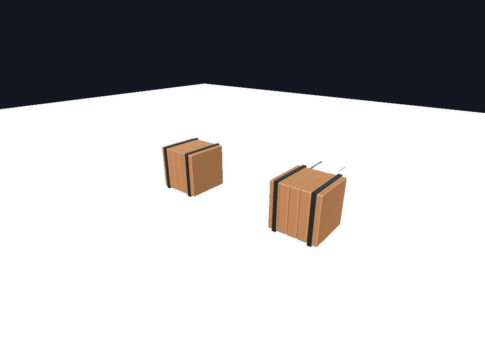

# Prompt-to-Scene

**Tell your AI what to build. See it appear in Unity or Unreal. Keep refining it by conversation.**

[简体中文](README.zh-CN.md) · [Download](https://github.com/316sandon12/prompt-to-scene/releases/latest) · [Beginner guide](docs/QUICKSTART.zh-CN.md) · [Verified results](docs/verification.md)

Prompt-to-Scene connects **Codex or DeepSeek Harness → Blender → Unity / Unreal Editor**. It runs Blender locally, imports native geometry and materials, places the prop in your scene, and verifies the result. There is no extra modeling subscription or project upload by this bridge; your AI client keeps its existing model connection.

> v0.3 is an experimental release for static opaque props. Blender, an engine editor, and an AI client are separate prerequisites. The downloadable setup app bundles Python and handles bridge/plugin configuration.



*Two instances in the real Unity integration test. The workflow changed one instance, revised the asset, restored an earlier source and requested this engine-rendered PNG.*

## Install

[**Windows download**](https://github.com/316sandon12/prompt-to-scene/releases/latest/download/Prompt-to-Scene-windows-x64.zip) · [**macOS Apple Silicon download**](https://github.com/316sandon12/prompt-to-scene/releases/latest/download/Prompt-to-Scene-macos-arm64.zip)

1. Extract the archive and open **Prompt-to-Scene**. On Windows keep both EXE files together.
2. Select your Unity project folder or Unreal project, then click **Connect / 连接并准备项目**. Blender is detected automatically; choose its executable if necessary.
3. Click **Install Codex plugin** or **Install Harness plugin**. Restart that client and open a new chat. Keep the engine open outside Play mode; restart UE once after its bridge is installed.

Say: **“Use Prompt-to-Scene to make a wooden crate with metal straps and place it in my project.”**

The app also has a **Generate example crate / 生成示例木箱** button to test the complete pipeline without an AI account. No terminal, Python installation, MCP JSON editing or manual bridge copying is needed for the packaged path. The setup window can be closed after installation.

Community binaries are unsigned on Windows and ad-hoc signed, not notarized, on macOS. The operating system may require its normal first-launch approval. Installation details, client detection and common errors: [beginner guide](docs/QUICKSTART.zh-CN.md). Source users can run `uv sync --locked` and `uv run prompt-to-scene-app`; other MCP clients can use [manual setup](docs/manual-setup.md).

## Create, select, refine

> “Make a table 1.5 meters wide. Put it near the scene camera.”
>
> “Make the selected object 20% smaller and move it one meter along X.”
>
> “Change only this one's wood to green.”
>
> “Undo that color change.”
>
> “Make the original table taller, keeping its other details.”
>
> “Restore its previous model and show me the result.”

| Capability | Behavior |
| --- | --- |
| Native host plugins | Codex plugin + shared skill; Harness bundle using its official MCP client. Both use the same local runtime and project records. |
| Setup and diagnosis | Project/Blender discovery, native picker, bridge backup/update, heartbeat, Play mode and version checks. |
| Repeatable props | Crate, table, chair and sign recipes retain parameters across clients. Custom shapes use AI-authored Blender Python. |
| Placement | Omitted coordinates place near the editor camera on a collision surface, falling back to the ground plane. Explicit coordinates remain available. |
| Selected-instance edits | Native move, rotation, scale and material tint. Other instances stay unchanged unless asset scope is requested. |
| Background jobs | Immediate task IDs, progress/status polling, cancellation and actionable errors. A wait timeout does not cancel the work. |
| Recovery | Restore a successful source revision; undo a tool's instance edit. The agent workflow limits automatic script repair to two retries. |
| Real previews | Engine-rendered PNG returned through MCP; a failed preview does not imply failed import. |

Generated asset identity, scene transforms and supported instance tints survive revisions. Unity prefab-root scripts/components and Unreal Actor labels/tags remain intact. Save your scene or level normally. Source history, task receipts and undo snapshots stay in the project; setup adds the local state directory to its `.gitignore`.

## Supported assets

- Blender meshes with applied modifiers and opaque Principled BSDF materials; editable `.blend` snapshots per revision.
- Native FBX, base color, metallic, roughness, direct base-color and tangent normal textures.
- Unity Built-in Standard / URP Lit materials, prefabs and optional box colliders.
- UE Default Lit materials, combined Static Meshes, Actors and optional box collision; no C++ build.
- Publish a compatible saved `.blend` produced by another Blender AI tool with `publish_blend`.

[Asset contract](docs/asset-contract.md) · [Tools and architecture](docs/architecture.md) · [Unreal details](docs/unreal.md)

Automatic baking, transparency, rigs/animation, HDRP, arbitrary shader conversion and Blueprint generation are outside this release. Different renderers/lighting need not produce identical pixels. Generated Python runs as your local user; use your client's existing tool permissions. Source restore and edit undo are not a whole-project transaction, and an import that fails midway may leave partial engine assets.

## Verification

Real Blender 4.2.0, Unity 2022.3.62f3c1 Built-in + URP 14.0.11, and Unreal 5.7.2 were exercised on macOS Apple Silicon. Tests cover import, repeat revisions in one editor session, texture wiring, selection isolation, undo, identity, source restore, cancellation, ground placement and PNG return. Native Codex app-server and Harness ToolRuntime calls were verified without a paid LLM request.

The portable-app workflow builds and checks Windows/macOS binaries separately. A passing Windows package check is **not** Windows Unity/UE verification. See [the exact matrix and reproduction commands](docs/verification.md).

## Develop

```bash
uv sync --locked
uv run prompt-to-scene-app
uv run pytest -q
uv run ruff check .
uv run ruff format --check .
# Build on the target operating system:
uv run --group build python tools/package_app.py
```

MCP tools: `list_projects`, `connect_project`, `inspect_target`, `create_prop`, `revise_prop`, `inspect_asset`, `build_asset`, `publish_blend`, `get_asset_status`, `get_task_status`, `cancel_task`, `inspect_scene`, `edit_scene`, `undo_scene_edit`, `restore_asset`, `get_preview`.

This independent MIT project does not vendor Blender/Unity MCP implementations. It can complement [MCP for Blender](https://github.com/ahujasid/mcp-for-blender), [MCP for Unity](https://github.com/CoplayDev/unity-mcp) and [Blender Tools](https://github.com/EpicGames/BlenderTools). Blender, Unity, Unreal and the AI clients have their own licenses. See [LICENSE](LICENSE) and [CHANGELOG](CHANGELOG.md).
