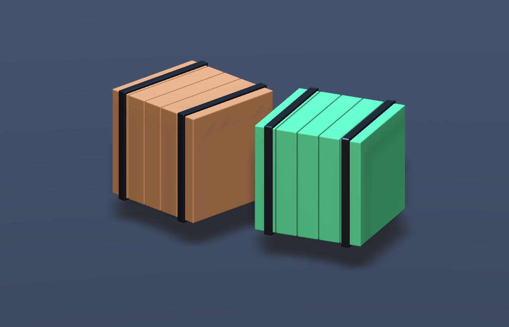

# Prompt-to-Scene

**Ask your AI to build a prop in Blender, place it in Unity or Unreal, and revise the same asset.**

[简体中文](README.zh-CN.md) · [Quickstart](#quickstart) · [Asset contract](docs/asset-contract.md) · [Architecture](docs/architecture.md)

An open-source MCP server with Unity and Unreal editor adapters for a complete **build → import → verify → revise** workflow. Your existing AI client writes Blender Python; this project runs Blender, transfers a validated asset, creates native materials and geometry, places an instance in the active scene, and returns an import receipt.

> **v0.2 experimental:** static opaque props; Unity Built-in/URP and Unreal Editor. Natural-language interpretation comes from your MCP-compatible AI client. No LLM or image-to-3D model is bundled. See the [verification matrix](docs/verification.md) for exact tested versions.



*Actual Unity render of the included Blender recipe, staged with two material variations. See the [real-engine checks](docs/verification.md).*

## The interaction

> “Create a one-meter wooden crate with iron straps in Blender. Put it at [2, 0, 3] in Unity and add a collider.”
>
> “Make the wood darker and the straps thinner. Update the same crate.”

The AI calls `build_asset`, then `get_asset_status` with that request ID and an optional wait of up to 30 seconds. Reusing the asset ID updates the existing prefab or Static Mesh. Existing instance transforms are preserved. A queued export is never reported as a successful engine import.

## What works

- Four MCP tools: `inspect_target`, `build_asset`, `publish_blend`, `get_asset_status`.
- Real background Blender execution; editable `.blend` source retained per revision.
- Native FBX import into Unity; no additional Unity import package required.
- Unreal content-only editor plugin: Static Mesh, native material graphs, persistent Actor identity and box collision. No C++ compilation.
- Principled BSDF base color, metallic and roughness; optional direct base-color and tangent normal textures.
- Materials adapted to Built-in Standard or URP Lit.
- Unreal Default Lit materials, meter-to-centimeter conversion and OpenGL-to-DirectX normal-map conversion.
- Stable ASCII material-slot IDs keep spaces and non-ASCII material names mapped correctly.
- Stable asset/material/prefab paths, automatic scene placement and box collider.
- Import receipts with request ID, engine asset paths, prefab/Actor identity, triangle counts and bounds.
- Engine detection, heartbeat freshness, bounded waiting and explicit stale-revision reporting.
- A CLI and a reproducible crate recipe, usable without an AI subscription.

## Requirements

- Python 3.11+ and [uv](https://docs.astral.sh/uv/).
- Blender 4.2+ (first verification target: 4.2).
- Unity 2022.3 with an activated editor (Built-in or URP), **or** Unreal Editor 5.7 with a working graphics device.
- An MCP-compatible client for natural-language use. CLI use does not require one.

Versions outside the recorded verification matrix are not a compatibility guarantee. See [verification](docs/verification.md).

## Quickstart

### 1. Get the server

```bash
git clone https://github.com/316sandon12/prompt-to-scene.git
cd prompt-to-scene
uv sync --locked
```

### 2a. Unity: install the package

In Unity: **Window → Package Manager → + → Add package from disk**. Select:

```text
unity/Packages/com.prompttoscene.bridge/package.json
```

Keep the cloned repository in place. Open a scene in the target project, leave Play Mode, and wait for compilation to finish. Both applications operate on your local machine; Blender is started as a separate background process by the server. You do not need a Blender MCP addon for this path.

### 2b. Unreal: install the plugin

Copy `unreal/PromptToScene` into `<YourUnrealProject>/Plugins/PromptToScene`. In Unreal, enable **Edit → Plugins → Prompt-to-Scene** and restart the editor. The plugin declares its Python Editor Script Plugin and Editor Scripting Utilities dependencies. Open a level and leave Play In Editor.

The [v0.2.0 release](https://github.com/316sandon12/prompt-to-scene/releases/tag/v0.2.0) also includes a standalone Unreal plugin ZIP. Extract its `PromptToScene` folder into the project's `Plugins` folder.

The plugin automatically watches the project inbox. No remote-execution setting, network listener or C++ build is required. Use the full editor with graphics enabled; commandlets and `-NullRHI` do not support this scene-placement workflow. See the [Unreal guide](docs/unreal.md).

### 3. Register the MCP server

Use your client's MCP server settings with this configuration. Replace every example path with your own **absolute** path:

```json
{
  "mcpServers": {
    "prompt-to-scene": {
      "command": "/absolute/path/to/uv",
      "args": ["--directory", "/absolute/path/to/prompt-to-scene", "run", "--locked", "prompt-to-scene-mcp"],
      "env": {
        "PTS_PROJECT": "/absolute/path/to/MyUnityProject",
        "PTS_ENGINE": "unity",
        "PTS_BLENDER": "/absolute/path/to/blender"
      }
    }
  }
}
```

On macOS the usual Blender executable is `/Applications/Blender.app/Contents/MacOS/Blender`. On Windows use the full path to `blender.exe`; backslashes in JSON must be escaped. The project path selects the destination explicitly, even if several Unity editors are open.

For Unreal, set `PTS_PROJECT` to `/absolute/path/to/MyProject/MyProject.uproject` and `PTS_ENGINE` to `unreal`. Omit `PTS_ENGINE` for automatic detection. The legacy `PTS_UNITY_PROJECT` setting still works for Unity. Register two separately named MCP servers if you want both engines available to the AI at once.

Try the interaction above. Ask the AI to inspect the target, follow the [asset contract](docs/asset-contract.md), and verify the returned request ID. Editors poll for work every two seconds while idle. `queued` means the engine has not confirmed an import yet. Positions always use **target-engine XYZ in meters**: Unity is Y-up; Unreal is Z-up and converts these values to centimeters.

### CLI smoke test

With the chosen editor open and the adapter installed:

```bash
uv run prompt-to-scene --project /path/to/MyUnityProject build crate --script examples/crate.py --position 2 0 3 --wait 30
uv run prompt-to-scene --project /path/to/MyUnityProject status crate

# Unreal: ground-level placement, coordinates in meters
uv run prompt-to-scene --project /path/to/MyProject.uproject build crate --script examples/crate.py --position 2 3 0 --wait 30
```

Results appear under `Assets/PromptToScene/crate/` in Unity or `/Game/PromptToScene/crate/` in Unreal. Save your scene/level normally; the bridge does **not** silently save existing scenes. Add `.prompt-to-scene/` to your project's `.gitignore` to exclude the local queue, logs and source revisions. CLI exit code 2 means an engine error, a superseded request or a wait timeout; the JSON describes which. A timeout does not cancel the pending import.

To publish a model created through another Blender AI tool, save it with its asset meshes inside a collection named `Export`, then call `publish_blend`. The original file is opened with auto-execution disabled and is not overwritten.

For a self-contained textured example, use `--script examples/textured_cube.py` with a different asset ID. It creates its own UVs, checker texture and normal map, without downloads.

## Revision behavior

Use the same `asset_id` to regenerate the same asset. Each `build_asset` script describes the entire asset from scratch; there is no persistent interactive Blender session. To edit an existing file, use another Blender tool and `publish_blend`.

- Source revisions remain in `<Project>/.prompt-to-scene/work/`.
- Imported `.meta` files and prefab/material GUIDs remain stable.
- Existing scene instance positions/rotations/scales and prefab-root components remain intact.
- The prefab's `Visual` subtree, root box collider and managed material properties are owned by the bridge. Put custom scripts on the prefab root; do not put manual overrides inside `Visual`.
- Renaming a Blender material creates a new material identity. Removed material/texture files are retained rather than automatically deleted.
- Unreal combines the asset's meshes into one Static Mesh. Asset paths and existing Actor GUIDs remain stable. Actor transforms, labels and user tags are preserved; mesh geometry, collision and generated material graphs belong to the bridge.
- A pending import must finish before rebuilding that asset. Different asset IDs have independent requests.

## Boundaries

This version deliberately rejects unsupported material nodes instead of silently exporting a different appearance. No automatic procedural texture baking, roughness/metallic textures, transparency, rigs, animation, LOD generation or Blueprint generation yet. Materials can differ under different engine lighting/color management; there is no pixel-identical rendering guarantee.

Blender scripts execute as your local user and are **not sandboxed**. Use trusted scripts and your AI client's tool permissions. Generated `.blend` files are local artifacts; no model or project is uploaded by this bridge. Import failures are reported, but there is no full rollback after a mid-import engine error. Keep projects under version control.

Upgrading from v0.1: update both the server and the Unity package. v0.2 publishes schema 2 requests; the old package rejects these. The new Unity package can still read queued schema 1 requests.

## Development

```bash
uv sync --locked
uv run pytest
uv run ruff check .
uv run ruff format --check .
```

For real Blender/Unity/Unreal integration verification, see [verification](docs/verification.md). CI exercises Python, request validation and the MCP protocol; installed editors are tested separately.

## Roadmap

- [x] AI-authored Blender Python → Unity scene with import receipts
- [x] Stable asset identity and revisions
- [ ] Texture baking and broader PBR input coverage
- [ ] Engine-side preview screenshots returned to the AI
- [x] Unreal Engine adapter using the same task/receipt contract
- [ ] Interactive Blender-session adapter and richer scene placement

## Related projects

[MCP for Blender](https://github.com/ahujasid/mcp-for-blender), [MCP for Unity](https://github.com/CoplayDev/unity-mcp), and [Blender Tools](https://github.com/EpicGames/BlenderTools) are useful adjacent projects. This repository is an independent implementation and does not vendor their code. It can receive a saved `.blend` produced by another tool through `publish_blend`.

## License

MIT. See [LICENSE](LICENSE). Blender, Unity, Unreal Engine and your AI client have their own licenses. Example geometry is generated by the included original Python recipe.
