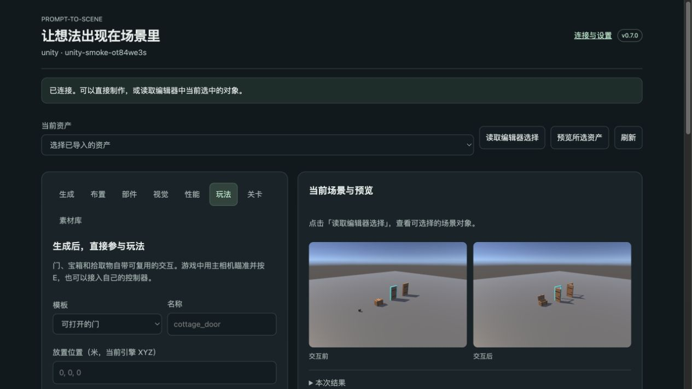

# v0.7：从模型到可测试的场景

这次增加玩法模板、更新保护、场景风格、模块关卡、真实试玩检查和项目素材复用。它们共用原来的连接、工作台和任务记录，不需要另装一套 AI 服务。

## 升级并开始

下载最新完整程序，选择原来的项目，再点 **连接并准备项目**。重新安装 Codex 或 Harness 插件以刷新工具说明，重启客户端。UE 还需要重启编辑器，载入新的 Python 文件和 Blueprint 模板。Unity 等待包编译完成即可。

保持引擎打开，普通建模和导入在编辑模式执行。**进入游戏检查**会主动启动 Play／PIE，完成后自行退出。场景的最终保存仍由开发者控制。

最短体验：打开 **创作工作台 → 玩法**，选择门、宝箱或拾取物，点击创建。完成后选中这个资产，点击试玩检查。也可以直接在 AI 客户端说：

> 用 Prompt-to-Scene 在当前项目里做一扇可交互木门，交互距离 2.5 米。使用温暖卡通场景风格，完成后进入 Play 检查开关门，给我看真实前后截图。

## 1. 有行为的道具

`create_interactive_prop` 提供 `door`、`chest`、`pickup`。门有独立门框与门板，宝箱有箱体和箱盖；倒角、硬件、UV 和 512 像素 PBR 贴图由本地 Blender 生成。传入尺寸、位置、颜色即可，默认无需准备脚本。

> 做一个宽 1.1 米、深 0.7 米、高 0.8 米的木宝箱，开盖 95 度。

Unity 输出带 `Interaction` 组件的 prefab，UE 输出 `/Game/PromptToScene/<id>/BP_<id>` 子 Blueprint。基础模板随插件提供，普通使用不需要 Xcode／Visual Studio 或 C++ 编译。

- 默认演示输入：主相机瞄准对象，按 **E**；只作用于射线击中的对象。项目需要已有可用的相机／玩家控制器，插件不替换你的控制系统。
- 自己的 Unity 控制器调用 `Interaction.TryInteract(worldPosition)`；坐标单位为米，成功交互触发 `onInteracted`。
- 自己的 UE 控制器调用 `TryInteract(WorldPosition)`；这是原生 Blueprint 世界坐标，单位为厘米。`OnInteracted` 可接项目事件。`Interact` 是不检查距离的直接入口。
- `configure_interaction` 可改角度、距离，关闭演示输入，或把现有的两个独立模型配置为门／箱体和活动部件。偏移与铰链位置使用目标引擎本地 XYZ，工具参数单位为米。

这是三种可编辑玩法模板；尚不包含背包、联网同步、复杂任务系统或任意 Blueprint 图生成。

## 2. 改模型时保留开发设置

> 把这扇门做宽一点，保留我的材质、交互距离和把手挂点。

对同一个交互资产 ID 再次创建，会更新两块网格并保留交互距离、开合角度和演示输入设置。已有场景对象身份和位置保持稳定，活动部件不会额外留在场景里。

在 **玩法 → 保留开发设置** 中查看绑定，输入规范材质槽名（例如 `Body`）和项目内材质路径即可绑定。也可添加命名挂点。Unity 挂点位于 prefab 根下；UE 使用附着到 Actor 的命名 TargetPoint。

手动给渲染器／Static Mesh 组件指定的不同材质也会被识别。重新导入时按原始材质槽名恢复；Unity 还核对对应网格节点。候选缺少受保护的槽或节点时，导入提前失败，保留当前引擎资产。用 `review_asset_update` 对保存的候选执行预检，明确重新绑定或清除覆盖后再发布。

保护的是材质**引用**、支持的根组件／Actor 设置、实例变换和命名挂点。生成的网格、生成材质内部属性仍归工作流管理；不要把需要保留的 Unity 自定义脚本放进会重建的 `Visual` 层级。跨未加载关卡／World Partition 单元的实例不在此次检查范围内。

## 3. 项目场景风格

**视觉 → 场景风格**提供温暖卡通、冷色科幻、月夜和中性四套预设。它们实际调整灯光、天空、色彩处理，并建立固定展示相机。

> 给当前场景应用月夜灯光，再从相同机位和温暖卡通版本比较。

首次应用后点 **查看场景画面**，换预设再拍摄。`set_scene_look(mode="restore")` 或 **恢复原有灯光**恢复之前保存的灯光／相机后处理状态。连续切换预设保留同一展示机位，便于判断差异。

Unity 支持 Built-in 自定义调色和 URP Volume；UE 使用灯光、SkyAtmosphere 和 PostProcessVolume。结果取决于项目渲染设置和原有后处理，预设不保证两个引擎逐像素相同，也不会替你重做所有素材的美术风格。

## 4. 可连接的模块关卡

**关卡**页提供房间—走廊—房间、楼梯连接上下层、转角三种起点。先 **查看布局计划**，再 **搭建关卡**。同一个名称可重新搭建，失败的临时几何会清理，原来的模块保持可用。

> 在空地上做两个房间，用一段楼梯连接到二层。门宽 1.2 米，玩家高度 1.8 米，检查有没有堵路。

AI 可以通过 `build_level` 组合最多 24 个网格模块，指定门宽、层高、玩家半径／高度、最大台阶高度、起点和水平旋转。先验证连接口、连通图和楼梯上下平台，再用引擎原生胶囊碰撞查询检查采样位置的净空。

这是一套可继续加工的 blockout。它不生成 NavMesh，也不代替真实玩家控制器、斜坡规则或完整路线行走测试；采样点之间的细小障碍仍可能需要人工试玩发现。

## 5. 真实 Play／PIE 检查

**玩法 → 检查所选道具**，或 **关卡 → 进入游戏检查**。AI 使用 `run_playcheck` 可以一次测试最多 16 个交互资产和一个模块关卡。

实际进入运行世界，检查远距离交互是否拒绝、事件计数是否增加、活动网格是否移动并能关闭、拾取物是否隐藏、通道是否被挡、是否记录到运行错误。默认拍摄交互前后画面，采集 1–20 秒真实帧间隔，随后返回编辑模式。

看报告的 **passed** 和逐条检查；任务执行完成不代表所有断言通过。帧时间是当前编辑器、当前机器的测量值，不是发布平台的 FPS 保证。进入 Play 也会执行项目本身的脚本；有联网／外部写入逻辑的项目应使用自己的测试场景。

任务卡可查看结果和前后截图，也可取消正在等待／运行的检查。源模型回退、布局撤销、退出 Play 各有不同范围，不提供全项目回滚。

## 6. 先找项目里已有的素材

在 **素材库** 输入“木门”“cozy”“stone”等描述，点击搜索。结果包含原生资源路径、尺寸、面数、标签和来源／许可证说明，支持按需原生缩略图预览，直接放置原资产引用。

> 先找项目里已有的木门。给我看预览，合适的话直接复用，别重复生成。

`search_project_assets` 第一次返回索引任务；等待后用同一个 `request_id` 和关键词读取排序结果。`reuse_project_asset` 预览或放置，`tag_project_asset` 保存标签、备注、来源和许可证。

检索基于名称、标签、中英文关键词映射和可选尺寸，当前不是视觉向量搜索。单次索引最多 2,000 个项目资源；达到上限会明确报告。已有的可验证来源会带入，未知许可证保持未知，不自动给第三方模型授予开源许可。

## 工具与测试

新增 10 个工具，连同既有功能共 57 个；Codex、DeepSeek Harness 和本地工作台共用同一实现。具体环境、真实引擎测试和复现命令见 [验证记录](verification.md)。UE 模板使用 5.7.2 保存，旧版本 UE 的资产兼容性尚未验证。
