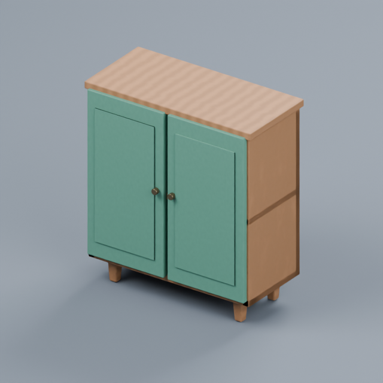
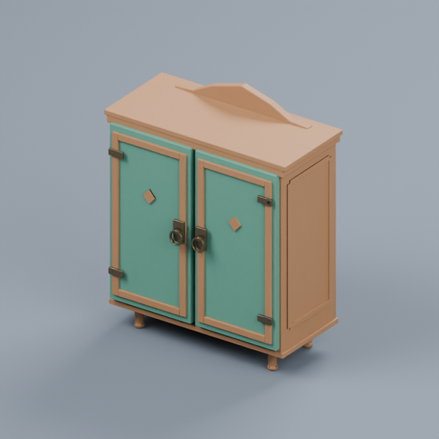

# 让 AI 识别项目风格，再按玩法制作资产

本页功能已包含在 v0.10.0。安装后连接项目、更新 AI 客户端插件即可使用；[完整创作流程](PRODUCTION.zh-CN.md)。

## 直接描述意图

第一次可以说：

> 看一下这个项目现有家具的真实画面，识别并记住它们的配色、比例、材质和细节风格。
> 我的游戏是采集和经营玩法，玩家会近距离整理物资。后续做的东西都跟这个风格匹配。

然后直接说：

> 给草药铺做一个精细的储物柜。看起来像当地木匠做的，玩家容易看见把手，放进当前项目。

也可以提供参考图片。AI 会保存并读取图像，不需要你手填色值或选择风格分类。
有明确造型要求时，AI 编写对应的 Blender 建模脚本；普通家具可以使用带工艺细节的模板。

## 自动匹配什么

| 依据 | 会影响的内容 |
| --- | --- |
| 项目真实缩略图／参考图 | 配色、轮廓比例、边缘软硬、材质粗糙度、细节密度，以及后续建模的文字规范 |
| 游戏玩法 | 实际用途、交互位置、活动部件的空间要求和视觉重点 |
| 背景与世界设定 | 材料与工艺、制造方式、合理的使用痕迹和定制造型的故事细节 |
| 玩家观察方式 | 俯视时的整体识别、近看时的接缝与结构细节，避免到处堆装饰 |

图像识别由当前具备看图能力的 AI 客户端执行。插件把分析保存成颜色、材质参数和设计说明，
并在每件资产开始制作时保留快照。Codex 和 DeepSeek Harness 共用这些项目记录。
无需额外识图服务；本地参考图也不会自动上传给模型生成服务。

色彩和粗糙度是参考光照下的估计。无法识别的材料保留原值；低置信度分析不会覆盖已有风格。
客户端无法看图时，应使用文字设定并说明局限，不能声称已经识别画面。

## 模型本身的改进

模板增加框架式柜门、成型冠饰、把手与铰链、车制支脚、修补加固件、机械面板等有限的结构语言。
木纹沿每块木料的方向延伸；俯视资产降低表面噪声，近景资产保留更多结构细节。
颜色、粗糙度与边缘处理可以继承参考分析，无须限定为内置三种配色。

下图是同配色、同机位、同照明的真实 Blender 渲染，演示模板结构变化；不是引擎截图，也不是识图准确率评测。

| 原模板 | 按近看与手工工艺细化后 |
| --- | --- |
|  |  |

复杂的特定外形仍由 AI 定制建模。模板细节、更多面数和成功导入都不等于达到目标美术品质。
AI 应查看真实模型画面并针对具体问题修正；无需每次让用户选择三个方案或重复批准。

## 修改已有资产

保存项目风格只影响后续设计。旧模型保留当时的设定，进行中的任务也不会被另一段对话改变。
可以说：“把这个柜子按现在的项目风格重新设计，保留我锁定的柜门。”
AI 会更新这件资产的设计，再应用到模型。几何和材质锁仍分别生效。
装饰把手本身不含开门逻辑；交互效果沿用现有组件／蓝图流程。

本地创作台“生成”页可保存背景、玩法和观察方式，制作时自动保存未提交的设定。
嵌入式界面的“交给当前 AI 制作”会带上这些信息。独立创作台的模板按钮执行有限的模板变化；
自由描述的理解与识图由聊天中的 AI 完成。

## 给贡献者

- `match_game_style`：向宿主返回真实图像与来源凭据，接受分析，转换 sRGB 色值并保存样式；拒绝变更过的图像证据。
- `game_art_direction`：保存玩法、世界、风格说明、视角、工艺和细节级别；未提供的字段保留。
- `design_asset`：保存单件资产设计；默认定制建模，显式指定 `recipe_kind` 才使用模板。
- `build_asset`：有设计记录时自动烘焙支持的不透明 PBR 材质、准备预算并保留设计快照。
- `revise_prop(apply_design=true)`：应用已保存的新设计，保留被锁定的部分。
- 文本生成服务收到预算内的设定；`effective_prompt` 与 `shortened_context` 显示实际发送内容。
  原始提示词完整保留。Meshy 图片路线仍以所选图片为输入，不接收这段文本。

`uv run python tools/game_art_smoke.py` 可重现上述 Blender 对照。输出集中在 `.local/game-art-demo/`，
验证后清理临时工程、中间图和日志即可。
