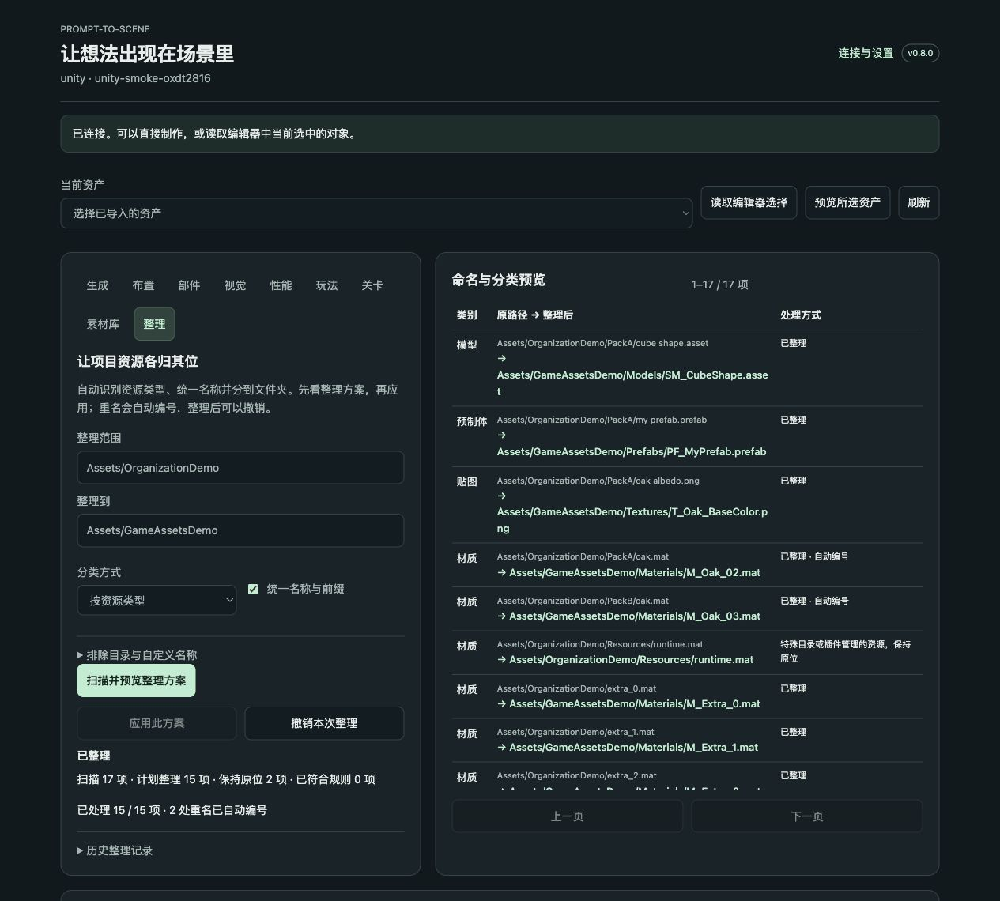

# 自动命名与归类

v0.8 新增「整理」页，用来整理整个 Unity `Assets` 或 UE `/Game`，也可以只处理一个素材包目录。它读取引擎实际资源类型，生成统一名称与分类路径，再通过引擎执行移动。无需新的 AI 服务，也不需要为整理功能安装 Blender。

## 最短使用流程

1. 更新完整程序，选择原项目，点 **连接并准备项目**。Unity 等待编译；UE 重启编辑器。
2. 打开 **创作工作台 → 整理**。范围留空代表整个项目；建议第一次填写想整理的素材目录。
3. 点 **扫描并预览整理方案**，查看原路径、新路径、类别和保持原位的原因。
4. 点 **应用此方案**。完成后按平常方式保存场景／关卡。需要恢复名称和位置时，点 **撤销本次整理**。

关闭程序或重启编辑器后，仍可在 **历史整理记录 → 刷新记录 → 查看记录** 中撤销。撤销不会覆盖后来占用原路径的新资源；需要先处理该冲突。

在 Codex 或 DeepSeek Harness 中也可直接说：

> 用 Prompt-to-Scene 整理当前项目的 Assets。按资源类型分类，统一名称和前缀；保留 ThirdParty 目录，完成后告诉我整理数量和跳过原因。

> 先给我预览 Assets/ImportedPack 的整理方案。保留来源文件夹的分组，把 Cube.fbx 命名为 CastleDoor。

> 撤销上一次资源整理，恢复原来的名称和目录。

使用 AI 客户端时，也需要重新安装／更新客户端插件并开启新会话，以载入新的工具说明。当前共 65 个 MCP 工具。

## 默认分类与命名

Unity 默认目标是 `Assets/GameAssets`，UE 是 `/Game/GameAssets`。可改成项目已有的资源根目录。

| 资源类型 | 目录 | 命名前缀／例子 |
| --- | --- | --- |
| 模型 | Models | `SM_WoodChair` |
| UE 骨骼模型 | Characters | `SK_Knight` |
| Unity prefab | Prefabs | `PF_WoodChair` |
| UE Blueprint | Blueprints | `BP_WoodDoor` |
| 材质／UE 材质实例 | Materials | `M_Wood`／`MI_Wood` |
| 贴图 | Textures | `T_Wood_BaseColor`、`T_Wood_Normal` |
| 精灵 | Sprites | `SPR_Coin` |
| 音频 | Audio | `S_DoorOpen` |
| 动画／控制器 | Animations | `A_Walk`／`AC_Character` |
| 特效 | VFX | `VFX_Fire` |
| 字体 | Fonts | `F_Main` |

只改变名称和目录，保留文件扩展名和资源内容。同名目标不会被覆盖，会得到 `_02`、`_03` 等编号。按同样规则再次整理已符合规范的资源，会保持原位。

贴图通道根据原有名称和可读取的导入信息判断，支持底色、法线、粗糙度、金属度、AO、自发光、高度和打包通道；未知通道不会被猜成某一种。文件名和中文名称可规范化；想把 `Cube` 识别成“城堡木门”，应在「指定名称」填写 `原路径 => CastleDoor`，或交给当前 AI 客户端依据你提供的上下文指定。这不是视觉识别模型。

关闭「统一名称与前缀」只移动分类，不改名称。「保留来源分组」会保留范围内原来的相对父目录，再按资源类型归类。需要自定义分类目录和前缀时，AI 可通过工具的 `settings.rules` 指定，例如 `{"material":{"folder":"Surfaces","prefix":"MAT_"}}`。

## 引用、保护与撤销

Unity 使用原生 `AssetDatabase.MoveAsset`，保留 `.meta` 和 GUID。UE 使用一次原生 `AssetTools.rename_assets` 批量处理相互引用的资源，并保存资源、保留必要的重定向。不会直接在磁盘上改 `.uasset`、素材文件和 `.meta` 名称。项目素材库中已有的标签、笔记与来源说明会跟随整理和撤销迁移。

整个目录会被扫描并分类，但以下内容默认保持原位，方案会显示原因：

- 脚本、场景／关卡、数据配置、着色器和未支持的类型。
- `Resources`、`StreamingAssets`、`Editor`、`Plugins`、Addressables 等特殊目录，以及 Unity 已有 AssetBundle／Addressable 地址的资源。
- Prompt-to-Scene 管理的生成资源及源模型修订明确复用的材质路径，避免后续重建找不到它们。
- 依赖外部相对路径的 Unity OBJ、glTF、BLEND、DAE 和带 FBM 附属目录的模型。
- 只读、未保存、通过符号链接访问，或目标路径过长的资源。

原生序列化引用与自己代码中的路径字符串是两回事。插件不改代码／配置中的任意字符串；项目若使用 `LoadAsset("某个固定路径")` 等自定义加载方式，请把这些资源加入排除列表。UE 的重定向不是发布构建中任意字符串路径都可用的保证。

应用前会再次核对资源身份、预览时状态和目标占用。状态变化时重新生成方案即可，不会覆盖同名资源。Unity 分帧处理，UE 交给原生批量重命名；取消会在可处理中断的位置生效，并尝试恢复本次已完成的移动。若恢复遇到新的路径冲突，会明确返回 `recovery_required`，可从同一记录继续撤销。

撤销恢复的是名称和位置，保留资源后来修改的内容。它不会撤销整个项目、恢复代码或回滚场景修改。空目录可能保留；不自动删除资源、不清理未知文件，也不自动清除 UE 的必要重定向。

## 工具流程与规模

`organize_project_assets` 的模式：

1. `scan`：原生扫描，`scope` 为可选项目目录；等待返回的任务完成。
2. `plan`：传 `scan_id=扫描任务的 request_id`，得到保存的 `plan_id`。
3. `inspect`：分页查看方案；`offset` 从 0 开始，`limit` 为 1–500。
4. `apply`：执行该 `plan_id` 的方案；等待同一个任务并检查最终状态。
5. `history` / `undo`：查看最近记录或恢复指定方案的原路径。

单次最多扫描 20,000 个资源。到达上限会报告不完整，并要求缩小范围，不会把部分结果当成整个项目已经整理完。扫描与方案保存在项目 `.prompt-to-scene/organization` 中；保留它才能使用本功能的历史和撤销。

复现环境、实际原生引用检查和重启测试见 [验证记录](verification.md)。实现使用的官方接口：[Unity MoveAsset](https://docs.unity3d.com/2022.3/Documentation/ScriptReference/AssetDatabase.MoveAsset.html)、[UE AssetTools](https://dev.epicgames.com/documentation/en-us/unreal-engine/python-api/class/AssetTools?application_version=5.7)。
