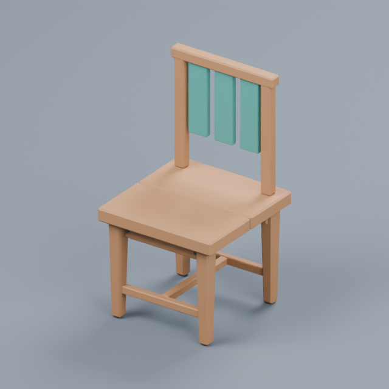
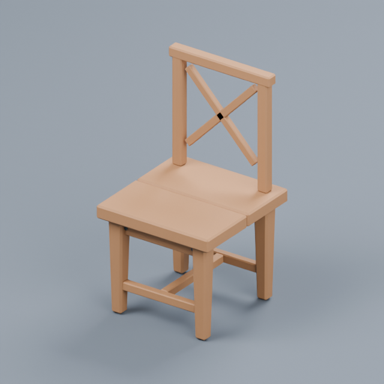
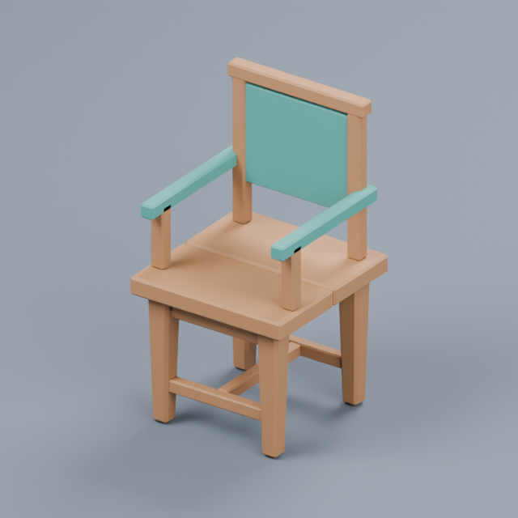

# Verification

## v0.10.0 — recorded on 2026-10-08

Environment: macOS Apple Silicon, Blender 4.2.0, Unity 2022.3.62f3c1 Built-in / URP 14.0.11,
UE 5.7.2. [Sanitized record](verification-v0.10.json) · [Usage](PRODUCTION.zh-CN.md).

| Check | Result |
| --- | --- |
| Python and MCP | 226 tests passed on the release source in [CI](https://github.com/316sandon12/prompt-to-scene/actions/runs/37738838411), after local full-suite and focused regression checks. Full discovery exposes 69 tools; installed compact mode exposes 3. Exact-source/image guards, persisted preferences, saved designs and resume behavior are covered. |
| Real material import | Actual Blender procedural alpha baking and native opaque emissive, cutout and alpha-blended materials passed in Built-in, URP and UE. Shader modes, alpha texture packing, culling and HDR emission parameters were asserted; actual images inspected. |
| Native game camera | Before/after images use the real camera and scene lighting. Additional checks change the live camera's lens/aspect between captures and verify that the saved comparison stays at 1024×576. Unity also retains the projection matrix. |
| Editable design reuse | Save a custom Blender design, alter one named part and import a new asset; the untouched part retains the same measured geometry hash. A recipe family is also saved, instantiated and adopted for future briefs. |
| Furnished room | Build a real 6 m room, create table/shelf/resource through one parent task, place measured props and pass native player capsule clearance in both engines. |
| Gameplay | Real Play / PIE checks pass range rejection, three resource uses, depleted visuals, one-time depletion and switch on/off. Unity additionally asserts runtime event callbacks; UE verifies Blueprint state and configured hooks. No maintainer builder module is installed in the runtime test projects. |
| Hosts | Isolated native Codex plugin install/upgrade, 3-tool discovery and gateway call through app-server passed. Harness bundle configuration and shared stdio are covered; Harness is not installed locally for a fresh native-host run. |
| UI and local package | Real browser inspection of saved designs and populated furnishing controls, no console errors. Frozen macOS MCP, setup, embedded bridges, native panel service and detached Blender recipe/source jobs passed. |

Windows/macOS builds, 226 tests per OS and frozen full/compact MCP/setup/service checks passed in [release CI](https://github.com/316sandon12/prompt-to-scene/actions/runs/37738838387). Both public ZIP checksums matched; the downloaded macOS app passed signature and actual runtime checks. [Download v0.10.0](https://github.com/316sandon12/prompt-to-scene/releases/tag/v0.10.0). Native Windows
editors, shipping builds and autonomous aesthetic quality are not covered. Camera checks concern
supported native cameras, not every custom render feature. Furnishing uses bounds and sampled
clearance, not navigation-mesh traversal. Emission/alpha support does not include refraction.

Reproduction (disposable projects remain under `.local`):

```bash
uv run pytest -q
uv run ruff check .
uv run python tools/production_smoke.py --engine unity --editor /path/to/Unity
uv run python tools/production_smoke.py --engine unity --urp --editor /path/to/Unity
uv run python tools/production_smoke.py --engine unreal --editor /path/to/UnrealEditor
# Follow up on each same fixture without regenerating assets:
uv run python tools/production_smoke.py --engine unity --editor /path/to/Unity --verify-existing
uv run python tools/production_smoke.py --engine unity --urp --editor /path/to/Unity --verify-existing
uv run python tools/production_smoke.py --engine unreal --editor /path/to/UnrealEditor --verify-existing
```

The earlier game-art comparisons remain in [their focused record](verification-game-art.json).
The reusable maintainer scripts and concise evidence are retained; task-owned disposable projects,
logs, build outputs and probe screenshots are removed after release verification.

## v0.9.1 — recorded on 2026-10-07

Environment: macOS 15.8 / Apple M3 Pro, Blender 4.2.0, Unity 2022.3.62f3c1 Built-in + URP 14.0.11, Unreal 5.7.2. Tests use real native assets, Blender preparation, MCP calls and disposable projects. See [the project-workshop guide](PROJECT-WORKSHOP.zh-CN.md) and [sanitized measurements](verification-v0.9.json).

| Check | Result |
| --- | --- |
| Source / MCP | 182 tests passed; lint, formatting, JS syntax and shared skill validation passed. Covers profile merge/bounds, stable native paths, inbox dependency hashes/deduplication, evidence validation, preserved human corrections, annotation migration, vision opt-in and selective adaptation contracts. |
| Project conventions | Saved destination/prefix/preparation rules drive native imports in all three engine paths. Existing assets retain their recorded location. Suggestions count prefixes in actual native scans. |
| Automatic intake | A settled GLB is detected by the watcher, prepared by actual Blender and imported under the saved project layout. Repeated scanning skips its unchanged version. The editor service is started automatically in full editors; URP batch testing starts it explicitly because batch mode intentionally suppresses auto-launch. |
| Unity Built-in / URP | Actual rendered evidence, description correction/search, two material variants, selective assignment of only one target, native color/UV parameter checks and undo passed. Selection-limited organization through the native panel service also passed. |
| Unreal | The same flow passed on real static meshes and material instances. A native Editor Utility Widget loads in the normal plugin without the C++ builder; actual preview images render even in an empty level. |
| Vision | An actual loopback HTTP fixture verifies image-bearing requests and structured responses. Native tests use explicit fixture descriptions to verify evidence/search/corrections. No paid remote vision service or model-recognition accuracy is claimed. |
| Hosts | Actual isolated Codex app-server discovered 65 tools and invoked the plugin; actual Harness 0.2.0-rc.1 bundle registration and ToolRuntime invocation passed without an LLM request. |
| Local workbench | Saved profile auto-load, material-row selection and real before/after image galleries were checked in the browser; no observed console warnings/errors. This does not certify embedded MCP App UI support in every host. |
| Local portable macOS | Frozen 65-tool MCP/setup/bridge checks passed, including the real frozen editor service and detached Blender recipe/external-intake workers. The public v0.9.1 executable also passed these checks. |

The final native runs exited with code zero. Earlier full-editor UE fixture exits retained its async script notification and crashed during Slate/ICU teardown; the test driver now allows that notification to retire before quitting. The final complete flow was rerun successfully.

Both portable builds passed 182 tests, 65-tool frozen MCP/setup/bridge checks and graceful native-service shutdown in [release workflow 37501818287](https://github.com/316sandon12/prompt-to-scene/actions/runs/37501818287). Both public ZIP SHA-256 values matched. The downloaded macOS app passed ad-hoc signature validation and actual detached Blender recipe/external-intake jobs. Windows execution was checked in CI. An initial Windows test-cleanup failure at v0.9.0 was fixed by verifying normal service shutdown instead of terminating only its one-file launcher; the successful release is [v0.9.1](https://github.com/316sandon12/prompt-to-scene/releases/tag/v0.9.1).

Material adaptation preserves target geometry and textures; supported shader parameters control the result. Unity currently targets prefabs; UE targets static meshes and exposed material parameters. Semantic search is description/tag keyword matching, not embeddings. Windows native editors, older UE template compatibility, arbitrary shaders, rigging and animation are not covered. Native image pairs use simple fixtures to verify changes, not to demonstrate finished game art.

### Reproduce v0.9

```bash
uv sync --locked
uv run pytest -q
uv run ruff check .
uv run ruff format --check .
/path/to/blender --background --factory-startup --python tools/external_fixture.py -- .local/v05-fixtures
uv run python tools/codex_plugin_smoke.py
uv run python tools/harness_plugin_smoke.py --dsh /path/to/dsh
uv run --group build python tools/package_app.py
uv run python tools/packaged_smoke.py dist/bin/prompt-to-scene-core --blender /path/to/blender
```

For native checks, use disposable repository-local `.local/*smoke-*` projects with the current bridge installed. Copy `tools/UnityPipelineSmoke.cs` to the Unity project's `Assets/Editor` and launch Unity with `-executeMethod UnityPipelineSmoke.Run`. For UE, launch the full editor with `-ExecutePythonScript=/absolute/path/to/tools/unreal_pipeline_driver.py`. Once its `pipeline-ready` marker exists, run `uv run python tools/pipeline_smoke.py --project /repo/.local/ENGINE-smoke-EXAMPLE`. Repeat Unity with Built-in and URP. The driver creates fixtures and the smoke script writes `pipeline-evidence.json`; use neither against a working game project. Writing `{"operation":"stop"}` to `.prompt-to-scene/pipeline-command.json` exits the fixture editor. For headless Unity testing, also start `uv run python -m prompt_to_scene.app --editor-service /repo/.local/unity-smoke-EXAMPLE` and set `PTS_BLENDER` if Blender is not discoverable.

## v0.8 — recorded on 2026-10-04

Environment: macOS 15.8 / Apple M3 Pro, Unity 2022.3.62f3c1 Built-in + URP 14.0.11, Unreal 5.7.2. Organization uses real native assets, actual MCP calls and disposable projects. See [sanitized measurements](verification-v0.8.json) and the [actual workbench](images/organization-workbench.jpg).

| Check | Result |
| --- | --- |
| Python / MCP contracts | 173 tests passed; lint, formatting, JS syntax and shared skill validation passed. Includes deterministic names, collisions, texture channels, both engine paths, source grouping, custom rules, Unicode, exclusions, symlinks, scan limits, pagination, provenance migration and repeat-apply behavior. |
| Unity Built-in / URP | Native scan → preview → apply → editor shutdown/restart → undo passed. GUIDs, prefab links, scene mesh/material/texture references and protected Resources assets survived. Duplicate names received distinct numbered destinations. |
| Unreal | Native static mesh, Blueprint, material and texture references passed after editor restart, then undo restored original paths. A material outside the move batch retained its texture reference. One native rename batch preserves cross-references; package indexing selects the main asset rather than leftover Blueprint generated-class redirectors. |
| Conflict handling | Editing an asset after preview rejected the stale plan without moving it. Repeated apply returned zero changes; rescanning organized output produced zero moves. An unrelated asset occupying an original path blocked undo; removing the fixture conflict allowed undo. |
| Cancellation recovery | Built-in Unity cancellation after actual partial moves and UE cancellation immediately after a real native batch restored original resource paths and live references. Test drivers inject only the cancellation signal; normal move and reverse-move implementations run in the editors. This does not certify recovery from arbitrary process termination during disk writes. |
| Host plugins | Actual isolated Codex app-server discovered 58 tools and invoked the plugin. Actual Harness 0.2.0-rc.1 bundle registration and ToolRuntime invocation passed without a paid LLM call. |
| Local workbench | Browser scan/preview → apply 15 resources → reload/history → undo passed against a real Unity project. Native assertions verified restored references. No observed browser console warnings/errors. Embedded host UI support is not certified by this test. |
| Portable macOS / Windows | Both builds passed 173 tests and frozen 58-tool MCP/setup/bridge checks in [release workflow 37138006263](https://github.com/316sandon12/prompt-to-scene/actions/runs/37138006263). Local macOS packaging also passed actual detached Blender recipe and external-intake jobs. |
| Public downloads | Both ZIP SHA-256 values matched. The downloaded macOS app passed ad-hoc signature verification, 58-tool discovery, organization module/bridge installation, setup UI and actual detached Blender recipe/external-intake jobs. Windows executable checks passed in CI. |

Native Windows editors, older UE versions, shipping builds, arbitrary custom asset classes and application-specific string loading paths are not covered. Source scripts, scenes, managed assets and special loading folders stay in place; scanning/classifying a resource does not imply it will be renamed. Release checksums and measurements are in the JSON record.

### Reproduce v0.8

```bash
uv sync --locked
uv run pytest -q
uv run ruff check .
uv run ruff format --check .
uv run python tools/organization_smoke.py --project /repo/.local/unity-smoke-EXAMPLE --editor /path/to/Unity
uv run python tools/organization_smoke.py --project /repo/.local/unreal-smoke-EXAMPLE --editor /path/to/UnrealEditor
uv run python tools/codex_plugin_smoke.py
uv run python tools/harness_plugin_smoke.py --dsh /path/to/dsh
uv run --group build python tools/package_app.py
uv run python tools/packaged_smoke.py dist/bin/prompt-to-scene-core --blender /path/to/blender
```

The native scenario creates fixture assets, intentionally tests conflicts/cancellation and restarts the editor. Use disposable `.local/*smoke-*` projects only. Repeat Unity with Built-in and URP. Packaged Blender checks additionally exercise detached recipe and external-intake workers from the previous workflow.

## v0.7 — recorded on 2026-10-03

Environment: macOS 15.8 / Apple M3 Pro, Blender 4.2.0, Unity 2022.3.62f3c1 Built-in + URP 14.0.11, Unreal 5.7.2. Native tests use disposable scenes and real MCP calls. See [sanitized measurements](verification-v0.7.json).

| Check | Result |
| --- | --- |
| Python / MCP / contracts | 151 tests passed; lint, formatting, JS syntax and shared skill validation passed. Includes graph/door/capsule validation, protected candidate fields, failed-stage resume, successful-asset retention, provenance and Play screenshots through normal MCP. |
| Interactive templates | Actual Blender door/chest/pickup generation, UV/PBR baking, Unity prefabs and UE child Blueprints passed. UE test project contains no template-builder C++ module. Its generator also rebuilt an existing template successfully in a separate project. |
| Protected regeneration | Custom material, socket, 3.5 m interaction range and native instance identity survive base-mesh and complete two-mesh regeneration. Missing protected Body slot rejects the candidate before native replacement. No loose duplicate moving mesh remains. An additional UE migration case removes v0.7 slot metadata and verifies that an existing component material override survives the first update. |
| Reuse | Native index, keyword query, annotation, thumbnail and original-reference placement pass. A newly reused door retains its managed identity and is exercised alongside the original in URP and UE. |
| Scene looks | Warm and moonlit native PNGs captured from fixed presentation cameras. Previous lighting restored. URP Volume and UE PostProcessVolume run in their actual editors; UE uses explicit manual exposure and movable lighting. |
| Modular levels | Room → staircase → upper room builds with matched ports. Native standing-capsule clearance passes, then fails after a real blocking cube is added, and passes after removal. |
| Real Play / PIE | Range rejection, interaction events, displaced geometry, closing, pickup, level clearance, runtime errors and before/after screenshots pass. Checks return to Edit mode; editor processes exit with code 0. Behaviors are invoked through their native APIs; physical keyboard input and arbitrary player controllers are not certified by this test. |
| Hosts | Actual isolated Codex app-server discovers 57 tools and invokes the plugin. Actual Harness bundle/ToolRuntime invocation passes without an LLM request. |
| Local workbench | New gameplay/level/library panels render; read-only level planning and recorded Play image pairs work in the browser. No observed console warnings/errors. This is not certification of embedded Codex/Harness MCP App UI support. |
| Portable macOS | Frozen 57-tool MCP server, embedded UI/bridges and actual detached Blender recipe/external-intake jobs pass after the MCP parent exits. |
| Windows/macOS portable CI | Both builds, 151 tests per OS and frozen MCP/setup/bridge checks passed in [release workflow 37040814681](https://github.com/316sandon12/prompt-to-scene/actions/runs/37040814681). |
| Public release downloads | Both ZIP SHA-256 values matched. The downloaded macOS app passed signature verification, 57-tool discovery, Unity/UE bridge installation, setup UI and actual detached Blender recipe/external-intake jobs. Windows executable checks passed in CI. |

Unity test frame sampling runs in a batch editor without a continuously rendered Game view; UE uses offscreen PIE. The recorded intervals describe those execution modes and must **not** be converted into expected game FPS or GPU performance. Native Windows editors, shipping builds, older UE `.uasset` compatibility, networked gameplay and NavMesh/controller traversal are not covered.

Actual engine captures: [URP warm](images/development-unity_urp-warm_cartoon.png) / [moonlit](images/development-unity_urp-moonlit.png), [UE warm](images/development-unreal-warm_cartoon.png) / [moonlit](images/development-unreal-moonlit.png). Interaction pairs: [URP before](images/development-unity_urp-play-before.png) / [after](images/development-unity_urp-play-after.png), [UE before](images/development-unreal-play-before.png) / [after](images/development-unreal-play-after.png). They show template assets in test scenes; they are not an aesthetic score or finished game art.

### Reproduce v0.7

```bash
uv sync --locked
uv run pytest -q
uv run ruff check .
uv run ruff format --check .
uv run python tools/development_smoke.py --project /repo/.local/unity-smoke-EXAMPLE --editor /path/to/Unity
uv run python tools/development_smoke.py --project /repo/.local/unreal-smoke-EXAMPLE --editor /path/to/UnrealEditor
uv run python tools/codex_plugin_smoke.py
uv run python tools/harness_plugin_smoke.py --dsh /path/to/dsh
uv run --group build python tools/package_app.py
uv run python tools/packaged_smoke.py dist/bin/prompt-to-scene-core --blender /path/to/blender
```

Use the native scenario once with Built-in and once with URP. It installs the current bridge, starts a fresh test scene and records evidence before exiting the isolated editor. Do not point it at a working game project.

## v0.6 — recorded on 2026-10-01

Environment: macOS 15.8 / Apple M3 Pro, Blender 4.2.0, Unity 2022.3.62f3c1 Built-in and URP 14.0.11, Unreal Editor 5.7.2. The following use real Blender and native editors. The generation fixture returns an existing textured model; it is not an AI model-quality test.

| Check | Result |
| --- | --- |
| Python/MCP/protocol | 130 tests passed; lint, formatting and shared skill validation passed. Includes provider contracts, paid-submission recovery, GLB dependency isolation, locks, rotated layouts and optional UI resources. |
| Furnished scenes | Reading-corner set built and placed at 37°; native upper-chair vertices verify that the seat faces its table. Saving, copying a three-object layout and undo passed. Rotated-anchor placement and native support queries passed. |
| Visual repair | A measured 12 cm support gap was corrected; a subsequent seat-material repair refreshed the after image using the original frame. Both PNGs returned through MCP. A third repair was rejected. |
| Imported parts | Real textured GLB intake, grouping, independent geometry lock, material-only update, unlocking and source replacement passed. The untouched ceramic body's geometry hash remained unchanged. |
| Incremental updates | Actual receipts confirmed reuse of native geometry and unchanged material bakes. A separate real Blender check verifies invalidation for RGB/value outputs, edited packed pixels and normal-source geometry; untracked dependencies bypass the cache. |
| Usage presets | Applying the mobile preset reduces the 14,976-triangle source to at most 8,000; native texture dimensions become 512 × 512 and native LOD geometry is checked. Asset identity and existing placement survive. Metrics use actual editor geometry/material data; texture memory is explicitly an estimate. |
| Optional providers | Self-hosted HTTP fixture → GLB → Blender preparation → isolated candidate → selected publication passed in all three editor paths. Text, image and multi-image Meshy request contracts passed without a paid live API call. |
| AI hosts | Actual isolated Codex app-server discovered 47 tools and invoked the plugin. Actual Harness 0.2.0-rc.1 bundle/ToolRuntime invocation passed. |
| Local workbench / MCP App | Browser selection, part controls and real previews checked. A local MCP Apps protocol fixture exercised initialization, tool calls, selected-object model context and explicit user-message handoff. This is not certification of Codex/Harness in-chat UI support. |
| Local portable macOS app | Frozen 47-tool stdio, embedded HTML/JS and bridges passed. Detached Blender recipe and external-model jobs completed after the MCP parent exited. |
| Windows/macOS portable CI | Both builds, 130 tests per OS and frozen stdio/setup checks passed in [release workflow 36745451575](https://github.com/316sandon12/prompt-to-scene/actions/runs/36745451575). |
| Public release downloads | Both ZIP SHA-256 values matched. The downloaded macOS app passed signature verification, 47-tool discovery, optional UI resource checks and actual detached Blender recipe/external-model jobs. The Windows executable was verified in CI. |

Native fixed-frame examples: [Unity before](images/workbench-unity-before.png) / [after](images/workbench-unity-after.png), [UE before](images/workbench-unreal-before.png) / [after](images/workbench-unreal-after.png). These are draft assets in sparsely lit test scenes, not beauty renders or an aesthetic score. Source rendering and native project lighting remain separate.

Detailed measurements, package/download verification and recorded limitations are in [verification-v0.6.json](verification-v0.6.json). Windows editor runs and paid live Meshy generation are not covered. One intermediate UE run completed all functional assertions but crashed during editor shutdown in the EOS SDK; that run was rejected and rerun. The local workbench had no observed console errors; the protocol-fixture tab reported one unclassified `MutationObserver` exception despite successful functional exchanges.

### Reproduce v0.6

Use disposable `.local/*smoke-*` projects. These commands create a fresh test scene and install the current bridge into that disposable project.

```bash
uv run pytest -q
/path/to/blender --background --factory-startup --python tools/external_fixture.py -- .local/v05-fixtures
/path/to/blender --background --factory-startup --python tools/cache_checks.py
uv run python tools/authoring_smoke.py --project /repo/.local/unity-smoke-EXAMPLE --editor /path/to/Unity --workbench
uv run python tools/authoring_smoke.py --project /repo/.local/unreal-smoke-EXAMPLE --editor /path/to/UnrealEditor --workbench
uv run python tools/codex_plugin_smoke.py
uv run python tools/harness_plugin_smoke.py --dsh /path/to/dsh
uv run --group build python tools/package_app.py
uv run python tools/packaged_smoke.py dist/bin/prompt-to-scene-core --blender /path/to/blender
```

Run the Unity scenario once in Built-in and once in URP. `--usage-preset` runs only the focused mobile-preset scenario; it is also included in `--workbench`. The fixture provider is implemented in `tools/workbench_checks.py`. `tools/ui_host_smoke.py` serves a developer-only protocol host fixture; real host tool verification uses the two separate client scripts above.

## v0.5 — recorded on 2026-09-30

Environment: macOS 15.8 / Apple M3 Pro, Blender 4.2.0, Unity 2022.3.62f3c1 Built-in and URP 14.0.11, Unreal Editor 5.7.2. These are real Blender/editor runs; no LLM was asked to simulate results.

| Check | Result |
| --- | --- |
| Python/MCP/protocol | 100 tests passed, lint and formatting passed; includes external source checksums, dependency paths/redirects, catalog fallback, LOD manifests, comparison identity and partial kit submissions. |
| External formats | Actual GLB, FBX and Blender fixture files imported, baked and exported. Live Poly Haven search/download and glTF with external textures passed. |
| Measured simplification | Textured 14,976-triangle fixture reduced to 3,358, with 1,678/838-triangle LODs. Worst sampled base-mesh error was 0.2871% of that object's diagonal. A strict rejected budget retained the original geometry and published no inbox request. |
| Unity Built-in / URP / UE | Real MCP external preview → publication, native LOD counts/triangle counts, PBR textures and color spaces, dimensions, collision, and revision identity passed. Unity cooked colliders were also raycast-tested. |
| Repreparation | Increasing the budget recovered detail from the retained 14,976-triangle original, producing 7,678 triangles; removing LODs/collision produced one native LOD and zero collisions. Existing object identity and position survived. |
| Native comparisons | Before/after PNGs returned through MCP with an unchanged saved camera frame, in all three engine paths. Project lighting differs between engines. |
| Kits and selection | Reading-corner kit imported in all three paths; selecting its chair and editing the backrest preserved every other part's geometry hash. |
| Structural alternatives | All 27 drafts (nine kinds × three variants) rendered three source views and remained outside engine imports. |
| Hosts and portable app | Real isolated Codex app-server discovered 34 tools; Harness ToolRuntime invocation passed. Local frozen macOS app served MCP/setup/JS and completed detached recipe and external-model jobs after the MCP parent exited. |
| Windows/macOS portable CI | Both OS builds, 100 tests per OS and frozen app/setup checks passed in [release workflow 36726686142](https://github.com/316sandon12/prompt-to-scene/actions/runs/36726686142); both download archives published. |
| Public downloads | Both ZIP SHA-256 values matched. The downloaded macOS app passed signature verification, 34-tool stdio/setup checks and real detached Blender recipe/external-intake jobs. Windows executable was tested in CI. |
| Browser workshop | Actual Poly Haven search → isolated source preview → comparison → publication to Unity passed; real source views and native review gallery loaded with zero observed console warnings/errors. |

Actual images: [original fixture](images/prepared-model-before.png), [prepared fixture](images/prepared-model.png), [Poly Haven model](images/polyhaven-prepared.png), [Unity before](images/prepared-unity-before.png) / [after](images/prepared-unity-after.png), [UE before](images/prepared-unreal-before.png) / [after](images/prepared-unreal-after.png). The Poly Haven example is [Ceramic Vase 03 by James Ray Cock](https://polyhaven.com/a/ceramic_vase_03), CC0; Powered by Poly Haven. The native fixture uses sparse project lighting, not a final art presentation.

| Chair structure 1 | Chair structure 2 | Chair structure 3 |
| --- | --- | --- |
|  |  |  |

The sampled geometry check is not a formal maximum-distance or aesthetic guarantee. Colliders approximate shape. The external tests cover static opaque PBR, not arbitrary shaders, rigs or animation. The 27-draft run checks default parameters, not every possible dimension/style combination. Windows native Unity/UE remains untested; portable CI evidence is recorded separately in [the machine-readable results](verification-v0.5.json).

### Reproduce v0.5

Use the disposable `.local/*smoke-*` projects described below. The native driver starts a new test scene.

```bash
uv run pytest -q
/path/to/blender --background --factory-startup --python tools/external_fixture.py -- .local/v05-fixtures
uv run python tools/variants_smoke.py
uv run python tools/authoring_smoke.py --project /repo/.local/unity-smoke-EXAMPLE --editor /path/to/Unity --preparation
uv run python tools/authoring_smoke.py --project /repo/.local/unreal-smoke-EXAMPLE --editor /path/to/UnrealEditor --preparation
uv run python tools/codex_plugin_smoke.py
uv run python tools/harness_plugin_smoke.py --dsh /path/to/dsh
uv run --group build python tools/package_app.py
uv run python tools/packaged_smoke.py dist/bin/prompt-to-scene-core --blender /path/to/blender
```

The new editor scenario invokes import/publication/repreparation/review/kit/selection tools through real MCP. Native editor assertions independently read actual LOD geometry and collision counts. Omit `--preparation` to run the existing material reuse, tint, arrangement and undo regression; add `--variants` for candidate selection.

## v0.4 — recorded on 2026-09-30

Environment: macOS 15.8 / Apple M3 Pro, Blender 4.2.0, Unity 2022.3.62f3c1 (China build), URP 14.0.11, Unreal Editor 5.7.2. Native host versions: Codex CLI 0.159.0 and DeepSeek Harness 0.2.0-rc.1.

| Check | Result |
| --- | --- |
| Python, protocol and setup | 71 tests passed; lint/format passed. Includes geometry/material lock independence, project style isolation, layout collisions, setup without reverse DNS and non-destructive process probes. |
| Actual Blender library | All nine recipes exported, baked PBR maps and three source views checked; no draft inbox entries. Native vertex hashes verify frozen parts and material-only geometry invariance. |
| Unity Built-in, URP and UE | Real MCP creation of matching table/chair/stool; native baked-map and data-texture color-space checks; backrest-only revision preserves asset identity, other parts and instance tint. |
| Layout in all three paths | Four chairs around a selected table; undo removes three copies and restores the original; rearrangement and fitting a stool underneath succeed. Native PNG returned. |
| Existing material reuse | Unity Built-in and UE reuse an existing material reference; its asset file hash is unchanged. |
| Draft selection | Two real cabinet drafts leave Unity scene instance count unchanged; source image returns through MCP; choosing a draft bakes and imports a final cabinet. |
| Codex and Harness | Isolated real host registration and tool invocation passed. Codex discovered all 26 tools. No paid LLM calls needed. |
| Local portable macOS app | Frozen stdio tools, embedded bridge, local setup HTML/API and detached Blender baking pass after MCP exits. |
| Windows/macOS portable CI | Both builds, 71 tests per OS and actual frozen stdio/setup checks passed in [release workflow 36715117293](https://github.com/316sandon12/prompt-to-scene/actions/runs/36715117293). |
| Public release download | Both archive SHA-256 values matched. The downloaded macOS app passed signature verification, 26-tool stdio, a detached Blender PBR/preview job and setup HTML/API checks. |
| Workshop UI | Saved style and submitted three real barrel drafts through the browser; semantic parts, completed candidate cards, selected-candidate status and multi-view images checked. No browser warnings/errors observed. |

[Sanitized results](verification-v0.4.json). Actual renders: [Blender chair](images/authoring-chair.png), [cabinet](images/authoring-cabinet.png), [barrel](images/authoring-barrel.png), [Unity scene](images/authoring-unity.png), [UE scene](images/authoring-unreal.png). The native scenes use sparse fixture lighting; they verify engine geometry/material state, not production lighting or visual equivalence. Blender views use consistent studio lighting. These are actual model renders, not generated concept images.

These checks exercise deterministic recipes and real tools, not arbitrary LLM modeling quality. Baking was exercised at the mobile tier; higher tiers increase resolution/detail but are not a performance guarantee. Layout uses conservative world-axis bounds and keeps instance orientation. Windows portable CI is separate from native Windows editor validation; Windows Unity/UE has not been tested. Full logs remain local because they can contain personal paths and editor licensing details.

### Reproduce v0.4

Use disposable `.local/*smoke-*` projects created by the engine smoke scripts below. The authoring driver creates a new fixture scene, not a user's working scene.

```bash
uv run pytest -q
uv run python tools/art_smoke.py
uv run python tools/authoring_smoke.py --project /repo/.local/unity-smoke-EXAMPLE --editor /absolute/path/to/Unity --variants
uv run python tools/authoring_smoke.py --project /repo/.local/unreal-smoke-EXAMPLE --editor /absolute/path/to/UnrealEditor-Cmd
uv run python tools/codex_plugin_smoke.py
uv run python tools/harness_plugin_smoke.py --dsh /absolute/path/to/dsh
uv run --group build python tools/package_app.py
uv run python tools/packaged_smoke.py dist/bin/prompt-to-scene-core --blender /absolute/path/to/blender
```

`art_smoke.py` verifies one style per recipe across the three styles; it does not test every parameter combination. Native authoring checks install the current bridge into disposable projects. Use `--variants` for the additional source-study/publish workflow. The package test starts the actual frozen app, exits its MCP parent while a detached worker runs, checks baked output, then checks setup startup. Windows binary names end in `.exe`; omit `--blender` on machines without Blender.

## v0.3 — recorded on 2026-09-30

Environment: macOS 15.8 / Apple M3 Pro, Python 3.11.16, Blender 4.2.0, Unity 2022.3.62f3c1 (China build), URP 14.0.11, Unreal Editor 5.7.2. Native client checks used Codex CLI 0.159.0 and DeepSeek Harness `@deepseek-ai/dsh` 0.2.0-rc.1.

| Check | Result |
| --- | --- |
| Python/protocol/setup tests | 48 passed; lint and formatting passed |
| Blender recipes | Crate 1,404, table 540, chair 864, sign 216 triangles; actual background export |
| Unity Built-in and URP | Initial/revised import, textures and saved `.blend` publishing passed |
| UE native regression | Geometry, PBR, collision, Unicode material mapping, identity and textures passed |
| All three engine paths, real MCP | Recipe creation → grounded placement → selection → duplicate-instance isolation → transform → undo → tint → structural revision → source restore → edit undo → PNG → worker cancellation |
| Repeated in-session revisions | Original asset/object identity and collider=false preserved; selected-instance tint retained through shared geometry updates |
| Codex native plugin | Isolated registration and version upgrade; 16 tools; app-server invoked `list_projects` successfully |
| Harness native bundle | Isolated profile installation/config composition; real ToolRuntime invoked the registered MCP tool |
| Setup interface | Local browser layout inspected; token/origin rejection and connected-project state tested |
| macOS portable app | Built locally; actual frozen stdio server, bridge extraction, setup HTML/API checked |
| Windows/macOS portable builds | Both OS builds, pytest and frozen MCP/setup checks passed in GitHub Actions; see the [release workflow](https://github.com/316sandon12/prompt-to-scene/actions/workflows/package.yml) |

Native host verification invokes tools through each host's actual plugin runtime without asking an LLM to model an asset. The engine workflow uses an MCP client and deterministic recipes; it does not measure arbitrary natural-language modeling quality. Mac binary tests include a real detached Blender job after its MCP parent exits. Windows package tests do not establish Windows Unity/UE compatibility.

The fixture makes a floor at one meter, verifies automatic placement on it, then creates two instances. Tests assert that selected edits affect only one instance and shared model changes retain both identities. Unity runs the real editor in graphics-enabled batch mode with a test driver pumping its importer; UE uses the normal live watcher in a full graphics-enabled editor. Preview PNGs were visually inspected; lighting differs between pipelines. The fixture scenes are not saved after interactive edits.

Sanitized machine-readable summary: [verification-v0.3.json](verification-v0.3.json). [Unity preview](images/workflow-unity.png) and [Unreal preview](images/workflow-unreal.png) are actual tool results. Full logs remain local because they can contain personal paths or editor licensing information.

### Reproduce v0.3

First run the relevant engine smoke test below. Then use the disposable project it prints:

```bash
uv run python tools/workflow_smoke.py --project /repo/.local/unity-smoke-EXAMPLE --editor /absolute/path/to/Unity
uv run python tools/workflow_smoke.py --project /repo/.local/unreal-smoke-EXAMPLE/Smoke.uproject --editor /absolute/path/to/UnrealEditor-Cmd
uv run python tools/codex_plugin_smoke.py
uv run python tools/harness_plugin_smoke.py --dsh /absolute/path/to/dsh
uv run --group build python tools/package_app.py
uv run python tools/packaged_smoke.py dist/bin/prompt-to-scene-core --blender /absolute/path/to/blender
```

On Windows the core executable ends in `.exe`; omit `--blender` to verify only the self-contained package without a Blender installation. The two client tests create disposable host configuration directories, use no LLM/API key and do not alter the user's real client profiles. Harness's existing Node/pnpm environment must be available.

## v0.2 — recorded on 2026-09-30

Environment: macOS 15.8 on Apple M3 Pro, Python 3.11.16, Blender 4.2.0, Unity 2022.3.62f3c1 (China build), URP 14.0.11, Unreal Editor 5.7.2 (CL 49658320).

| Check | Result |
| --- | --- |
| Python/MCP/Unreal request validation | 37 tests passed |
| Unity Built-in and URP regression | First import, revision, textures and saved-source publishing passed |
| v0.1 → v0.2 Unity upgrade | Existing prefab GUID, scene position and custom root component survived the new FBX material IDs |
| Python packaging | Wheel and source archive built; Unreal plugin included in source archive |
| Unreal native import | One combined mesh, 1,404 triangles, native materials and box collision |
| Unreal revision | Height changed from 1.00 m to 1.25 m; green material revision applied |
| Unreal identity and user properties | Asset path and Actor GUID unchanged; position, yaw, scale, label, custom tag and shadow setting preserved |
| Unreal textures | Unicode material name, sRGB base color, non-sRGB normal, normal compression/green-channel flip, metallic and roughness verified |
| Saved `.blend` | Republished with packed textures; original file hash unchanged |
| Live MCP → Blender → automatic Unreal polling | Real stdio tool call and exact-request wait returned imported; editor asserted one Actor at the requested position |

The initial UE crate bounds measured approximately **1.005 × 0.992 × 1.000 meters**, confirming horizontal axis conversion and meter scale. The revision was **1.005 × 0.992 × 1.250 meters**. The imported Actor at input `[2, 0, 3]` was at `[200, 0, 300]` editor centimeters. The separate live workflow used `[1.5, -2, 0]` meters and checked the resulting Actor at `[150, -200, 0]` centimeters.

Sanitized receipts: [verification-v0.2.json](verification-v0.2.json). These checks validate supported geometry, material wiring and scene state, not pixel-equivalent rendering or arbitrary AI modeling quality. Unreal emits unrelated startup/FBX warnings on this installation; successful test markers and explicit scene assertions are required in addition to a zero exit code. Windows/Linux and other engine versions are not yet verified.

### Reproduce Unreal tests

```bash
uv run python tools/unreal_smoke_test.py --unreal /absolute/path/to/UnrealEditor-Cmd

# Use the disposable project path printed by the previous command:
uv run python tools/unreal_live_smoke.py --unreal /absolute/path/to/UnrealEditor-Cmd --project /repo/.local/unreal-smoke-EXAMPLE/Smoke.uproject
```

On Windows use `UnrealEditor-Cmd.exe`. The tests start the **full editor** with `-ExecutePythonScript` and `-RenderOffscreen`, not a Python commandlet. A functioning graphics device is required: UE 5.7 cannot place Actors through this API with `-NullRHI`. The test projects are disposable and isolated under `.local/`. The live test intentionally leaves automatic polling enabled and sends build/status requests through a real MCP client; its driver never calls `import_pending`.

## Python and Unity commands

Run the fast checks:

```bash
uv run pytest
uv run ruff check .
uv run ruff format --check .
```

The real-engine smoke test creates an isolated disposable project under `.local/`, invokes Blender, opens Unity in batch mode, imports a crate, revises it, then checks prefab identity and scene state. It also verifies base-color/normal textures, republishes a saved `.blend`, and rejects an unsupported procedural shader. It never opens an existing user project.

```bash
uv run python tools/smoke_test.py --unity /absolute/path/to/Unity
uv run python tools/smoke_test.py --unity /absolute/path/to/Unity --urp
```

Set `PTS_BLENDER` if Blender is not on PATH or in the standard macOS app location. Unity must be installed and licensed. A missing editor/license is a failure or limitation, not a passing engine test.

`--urp` installs URP 14.0.11 in the disposable Unity 2022.3 project. Successful runs print `PASS` and leave receipts, logs and `evidence.json` in that test project. Logs may contain local paths and licensing details; inspect them before sharing.

## Historical v0.1 run: 2026-09-30

Environment: macOS 15.8, Apple Silicon; Python 3.11.16; Blender 4.2.0; licensed Unity 2022.3.62f3c1. The editor build is the Unity China variant. Other editor versions, Windows and Linux have not been verified.

| Check | Result |
| --- | --- |
| Python/MCP tests | 14 passed |
| Ruff lint and format | Passed |
| Python wheel and source package build | Passed; Blender export driver included |
| Built-in: first import + material revision | Passed |
| URP 14.0.11: first import + material revision | Passed |
| Both pipelines: base-color + tangent normal texture import | Passed |
| Both pipelines: publish saved `.blend`, original file hash unchanged | Passed |
| Unsupported procedural texture | Rejected before publishing a request |

Each crate import produced **13 meshes and 1,404 triangles**, with bounds approximately **0.992 × 1.000 × 1.005 meters**. Both pipelines preserved the prefab GUID, the scene instance at `[2, 0, 3]`, and a custom Rigidbody component with mass 7 through a material revision. Rebuilding requested a different initial position to verify that an existing instance was not moved or duplicated.

The textured fixture verified native texture import settings (sRGB base color, Non-Color normal), shader assignment, normal-map keyword/strength, metallic, roughness-to-smoothness conversion, and `collider=false`. Saved sources retained packed images. These checks verify data transfer and material wiring, not pixel equivalence across Blender and Unity.

The sanitized engine receipts are in [verification-results.json](verification-results.json). `tools/UnitySmoke.cs` contains the engine assertions. The Python tests include a real MCP stdio subprocess for discovery, status and error reporting; licensed engine tests call the same core build implementation directly and explicitly invoke the Unity importer. The idle editor polling loop is not exercised by the batch test.

## Preview reproduction

The README image is a Unity render of the included crate. It stages two color variants with a camera and lights; it is not a capture of a natural-language chat session. After a successful **Built-in** smoke test, copy `tools/UnityPreview.cs` into that disposable project's `Assets/Editor/`, then run:

```bash
/absolute/path/to/Unity -batchmode -projectPath /path/to/disposable/project -executeMethod UnityPreview.Run -logFile /path/to/preview.log
```

Omit `-nographics` for this command. It writes `preview.png` in the project root and exits without saving the staged scene. A working graphics device is required.

CI runs Python and MCP protocol checks only; a green CI badge does not imply licensed Unity verification. No UE adapter or UE verification is included in v0.1.
